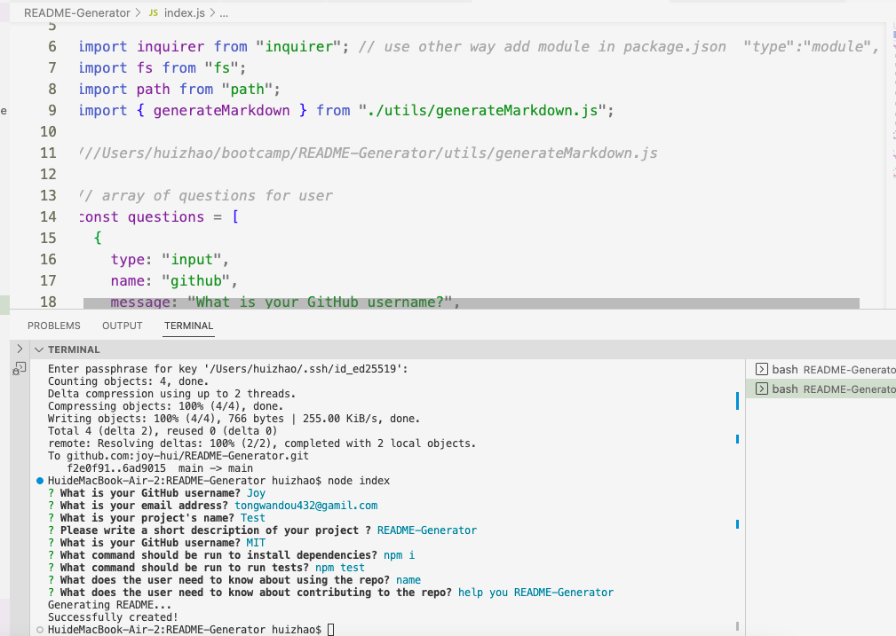
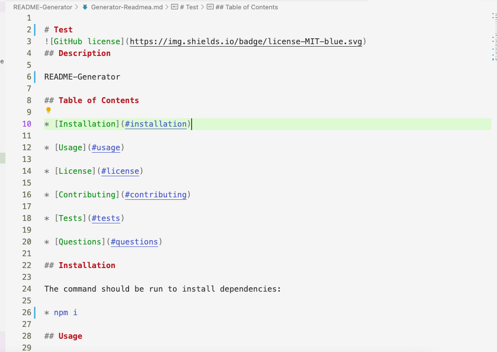

# README-Generator

## Description
* It's a code that user can quickly create a professional README for a new project.

## User Story
* As a developer, I want a README generator so that I can quickly create a professional README for a new project.

## Acceptance Criteria
* Create a command-line application that accepts user input.
  * When a user is prompted for information about the application repository then a high-quality, professional README.md is generated with:
    * The title of my project
    * Sections entitled: 
      * Description,
      * Table of Contents,
      * Installation,
      * Usage,
      * License,
      * Contributing,
      * Tests,
      * Questions
    * When a user enters the project title then it is displayed as the title of the README
    * When a user enters a description, installation instructions, usage information, contribution guidelines, and test instructions then this information is added to the sections of the README entitled Description, Installation, Usage, Contributing, and Tests
    * When a user chooses a license for their application from a list of options then a badge for that license is added near the top of the README and a notice is added to the section of the README entitled License that explains which license the application is covered under
    * When a user enters their GitHub username then this is added to the section of the README entitled Questions, with a link to their GitHub profile
    * When a user enters their email address then this is added to the section of the README entitled Questions, with instructions on how to reach them with additional questions
    * When a user clicks on the links in the Table of Contents then they are taken to the corresponding section of the README
 
## Table of Contents 

* [Installation](#installation)

* [Usage](#usage)

* [License](#license)

* [Contributing](#contributing)

* [Tests](#tests)

* [Questions](#questions)

## Installation
* You can create one by running npm init when you first set up the project, before installing any dependencies.
* The command should be run to install dependencies: npm i

## Usage
* The application will be invoked by using the following command: node index.js

## License

MIT
  
## Contributing

help you README-Generator

## Questions

If you have any questions please contact me, my email address is tongwandou432@gamil.com. 
This is my github: [Joy](https://github.com/Joy/).

